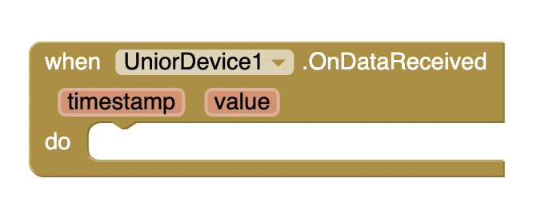

# Расширение для MIT App Inventor 2 для датчиков ПАК ЮНИОР

## Использование
- скачайте .aix файл со страницы Release
- добавьте компонент в ваш проект через вкладку Extension в Palette
- добавьте в приложение UniorDevice из вкладки Connectivity и укажите в Properties MAC-адрес датчика
- из вашего кода используйте вызов `.Connect` для того, что бы подключиться к датчику по Bluetooth

- после успешного подключения данные будут приходить на событие `.OnDataReceived`

где
  - `value` - значение датчика,
  - `timestamp` - временная метка (**НЕ РЕАЛИЗОВАНО**)

## Сборка
### Требования
* java 1.8 (either OpenJDK or Oracle)
  * Do not use Java 8 or newer features as our build system does not
    yet support this.
* ant 1.10 or higher
* git 2.3.10 or higher

`ant`

## Отдельное спасибо:
- @ewpatton за https://github.com/mit-cml/extension-template
- @leadpogrommer за моральную и техническую поддержку
